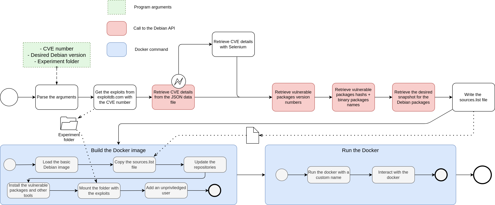

# An New Expert Vulnerability Reproduction Instrument for Security and Manipulation Experimentations (ANEVRISME)

This tool reproduces a vulnerable environment for a given CVE number. 

## Requirements 
- Docker (see the [official documentation](https://docs.docker.com/engine/install/))
- Firefox

## Build

- Install the requirements 
- Install the python dependencies (`pip install -r requirements.txt`)

## Example

Here is an example for the Pwnkit vulnerability :
   
`python cve_debian.py -n 2021-4034 -v bullseye -d pwnkit --selenium`

## Working principle

