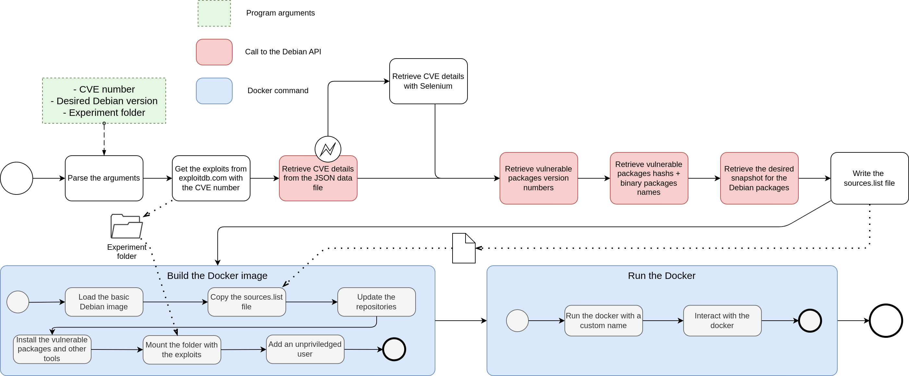

# DEbian Cve REproducer Tool (DECRET)

This tool reproduces a vulnerable Debian environment for a given CVE number.  


## License 

Copyright (c) 2023-2026 Orange
This code is released under the terms of the BSD 3-Clause license. See the `license.txt` file for more information.


## Requirements

- Python3
- Docker (see the [official documentation](https://docs.docker.com/engine/install/))
- Firefox


## Build and Usage

On Debian stable, a simple way to install DECRET is to first run the
following commands as `root`:

```shell
# apt install python3 python-is-python3 python3-venv
# apt install docker.io
# apt install firefox-esr
```

Then, you can download DECRET and its dependencies in a virtual
environment (using the `venv` module):

```shell
$ git clone https://github.com/Orange-OpenSource/decret.git
$ cd decret
$ python3 -m venv venv
$ source venv/bin/activate
$ pip install -r requirements-minimal.txt
```

You can use `requirements.txt` if you want to run the tests which are
run in the Continuous Integration pipeline.

Finally you can run decret like so:

```
python3 -m decret -n 2020-7247 -r bullseye --selenium
```

and see available arguments like so:

```
python3 -m decret -h 
```

## Example

You can find examples in the `examples` directory.

## Contributing

### Structure
1. ***/decret:*** Main Python source code
2. ***/tests:*** This is where the pytest code lives
3. ***/examples:*** Markdown files illustrating working examples


### Instructions
1. Fork this repository
2. Create a new branch: `git checkout -b feature/your-feature-name`
3. Make your changes, commit, push to feature branch etc
4. Ensure tests and linters pass

Our GitHub Actions run pylint, and pytest. Run them locally if possible:
```shell
black .
pylint decret/
pytest
```
5. Verify your code passes CI tests under `.github/workflows`
6. Open pull request

## Automated testing
To test if CVEs are functional in `DECRET`, you can use the automated script as follows:

### Step 1: Prepare your configuration file
- Create a text file (e.g., decret_auto.txt) listing the CVEs and, optionally, the releases to test.
- By default, the script uses the 4 latest Debian releases: `trixie`, `bookworm`, `bullseye`, and `buster`.  
If you want, you can specify of these releases, one or more, for each CVE in the configuration file.  
If no releases are specified for a CVE, all 4 latest releases will be tested automatically.  
- Syntax example:

```bash
2025-45765: trixie, bullseye
2015-5602: trixie, bookworm, bullseye, buster
2022-43995
```
### Step 2: Run the automated test script
- To run the tests, execute the following command:
```bash
python3 decret_auto/decret_auto.py decret_auto/decret_auto.txt
```
- This script will test each CVE by release from the configuration file and check if `DECRET` generates a valid Dockerfile for each (status file).
- The script may take some time to complete, depending on the number of CVEs and releases tested.

### Troubleshooting
If you encounter any issues, please refer to the [Troubleshooting Journal](./TROUBLESHOOTING.md) for solutions.

### Additional notes
- Make sure to respect the configuration file syntax.  
- For more details, refer to the source code and comments in `decret_auto/decret_auto.py`.

## Working principle


